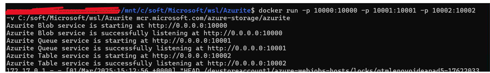
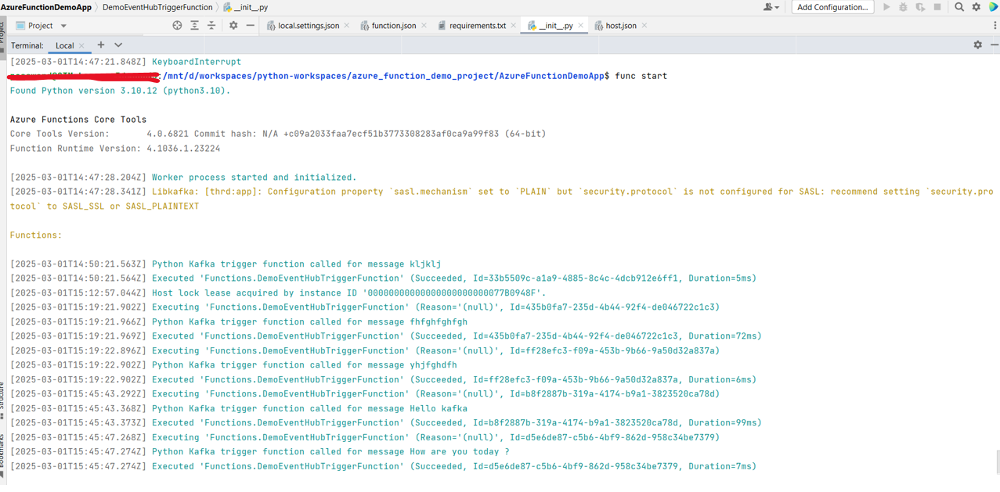

# azure_function_demo_project

This project involves creating an Azure Function on a local machine. The function is triggered by Kafka, making it a subscriber to a Kafka topic. It then publishes the data it receives from Kafka into a local Azure Blob Storage (using Azurite).

### Pre-requisites

-	Windows Subsystem for Linux (WSL) is installed
-	Docker is installed
-	Python version 3.10 is installed
-	PyCharm Community Edition or VSCode or any similar IDE is available
-	Azure Functions Core Tools is installed (https://learn.microsoft.com/en-us/azure/azure-functions/functions-run-local?tabs=windows%2Cisolated-process%2Cnode-v4%2Cpython-v2%2Chttp-trigger%2Ccontainer-apps&pivots=programming-language-python )
-	Azurite (for azure storage emulator) is installed (https://learn.microsoft.com/en-us/azure/storage/common/storage-use-azurite?tabs=docker-hub%2Cblob-storage)

-	Kafka (along with Zookeeper) is installed and running. A docker-compose file (either downloaded from the internet or located in the Docker folder) is used to set up Kafka. The following command is used to run the file:
     `docker compose up -d`

### Steps

  - Start Azurite (Azure Storage Emulator) if it's not already running.

  -	Create a Kafka Topic
      Run the following command to create a topic in the local Kafka instance:
      `docker exec -it <kafka-container-id> /opt/kafka/bin/kafka-topics.sh --create --zookeeper zookeeper:2181 --replication-factor 1 --partitions 1 --topic my-topic`
       o	The following command can be used to test the message publish
       `docker exec -it <kafka-container-id> /opt/kafka/bin/kafka-console-producer.sh --broker-list localhost:9092 --topic my-topic`
       o	The following command can be used to test the subscriber
       `docker exec -it <kafka-container-id> /opt/kafka/bin/kafka-console-consumer.sh --bootstrap-server localhost:9092 --topic my-topic --from-beginning`
-	To create an azure function for python, the commands written in the following image can be followed in order-

-	Please follow the codebase to understand the changes done after creation of the function
-	To run the function, func start or func start –verbose can be used

### Note

-	This is just for helping developers who are new in python and azure function, but the codebase is not production ready. Developer should change it as per the needs.
-	Instead of apache kafka, an eventhub emulator can also be used here -  https://learn.microsoft.com/en-us/azure/event-hubs/test-locally-with-event-hub-emulator?tabs=automated-script%2Cusing-kafka
-	To understand kafka-container-id, docker ps -a command can be used
